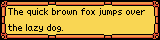
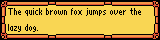
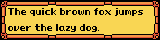
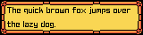
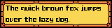
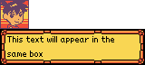
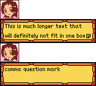

# Contributing

This translation project is driven by a small group of volunteers; Whether it's playtesting, editing or proofreading the localization, or contributing to the code itself, we could definitely use some help to try and get things done right. 

This document is written to help answer any common questions, but if you still have questions, feel free to reach out to us on the [Medabots community Discord server](https://discord.gg/2qJRzxpk) in the '#medarot_3_translation' channel.

If you run into a problem when playing the patch, go ahead and file an [issue](https://github.com/Medabots/medarot3/issues). We'll need reproduction steps, and ideally would prefer a save. We mainly use the [BGB](https://bgb.bircd.org/) emulator, so save states will work from this emulator, but otherwise a battery save will work (usually '.sav'). 

## Contributing to the Localization

The build process itself actually relies on various [CSV and text files](./text), but this isn't intuitive or easy to edit for most people without Git experience. To facilitate translation work, there are a set of scripts to convert from a [Google Sheet](https://docs.google.com/spreadsheets/d/1XJZ_bkZVklVCpPBEd3UXviA5vkZNPzHpOFxJFbuKX4Q/edit?usp=sharing). Access is read-only by default and you can ask in the Discord about edit access if you need it, or just let us know where you see issues via Discord or by filing a GitHub issue. 

The goal is to have two editors per text section, and at least one proofreader to sanity check the translation/context. Translation has traditionally been the most bottlenecked part of the patch, and so we rely on whatever time any translators can provide to submit lines when they can.

### The Google Sheet

There are several tabs in this Google Sheet:
* A Status tab that has an updating status, general translation style guide, some editing notes, and a manually updated list of contributors
* A Glossary tab that notes game-specific terms in the two localizations we plan to support (EN, a more direct translation of the Japanese terms, and EN-US, which uses the existing localization where possible/reasonable). 
* TextSectionXX tabs that contain the text and translation for most of the game's dialog, part descriptions, and just about anything else that appears in a text box in-game
* The remaining tabs refer to 'lists', things like attack names, enemy names, and other substitutable text

#### Text Sections

Within the TextSection tabs, there are several columns:
* An Index and Pointer, used when converting the sheet back into CSV format for building the patch; these should generally be left untouched
	* They may be useful for indicating a version difference
* 'Original', which refers to the original Japanese text
* 'Translated', which refers to the translation that will be pulled (this is the main column to modify)
* An empty column after the translation which is a free section for translators to note anything they think others should be aware of (context, questions, etc...); For concerns/requesting a check, consider using the Google Sheets 'comment' option instead, as it is easier to find
* 'Preview?', a checkbox column, which, when checked, will populate the subsequent column with a preview of the text in-game

#### Lists

Within the list tabs, the columns vary but in general they are:
* Index
* The original text/value
* The translated text/value 

### Text Syntax/Format

For the most part, text is laid out in the sheet in a format that's easier to read and then later converted, so new-line related codes aren't often seen in the sheet but will be seen in the converted CSV files. The original Japanese text has manual line-breaking and spacing to space things out into new text boxes and new lines.

```
This text is on line 1.
This text is on line 2.

This text is in a new
box.
```

#### Control Codes

There are a handful of control codes in text:

* `<S##>`: Sets text speed, lower numbers are faster, SFF is instant and S00 sets to default speed
* `<*##>`: Different end code, not including it implies '00' (normal ending). This is usually only different when dealing with user option boxes or some special events (i.e. voice clips).
* `<&BUF##>`: Pulls string from memory buffer, i.e. player's name or numbers
* `<@??,##,##>`: Displays face (R/L side of box, R/L flip, [character index or name](./scripts/res/portraits.tbl), expression index)
	* `<@CC,CLEAR,FF>` can be used to clear a portrait
* `<CD>`: Go to 2nd line of text box
* `<CF>`: New text box
* `<D1>`: New page without input (keeps portrait), in general this is implied

There is also an additional code specifically for the patch `<f##>` which is described more in the [Fonts](#fonts) section.

### Patch Specific Notes

The patch adds some features for translation convenience and necessity, they're described in the following sections.

#### Fonts

The patch adds a few new fonts due to necessity and translation flair. These fonts can be manually enabled with the font control code `<f##>`, but may also have a more intuitive way to enable them.

`<f00>` is the default font



`<f01>` is a more narrow font, mainly used when text box space is an issue (i.e. for part descriptions)



`<f02>` is a **bold** font (also possible to activate just by making font bold within the sheet), meant to act as a better way to emphasize things in text and is usually a drop-in replacement for the square bracket quotes (「」)



`<f03>` is a "robotic" font (possible to activate by making font *italic* within the sheet), meant to better encapsulate robotic/formal speech from Medabots that would otherwise just be in "ALL CAPS" to get the effect across



`<f04>` is a combined bold robotic font, activatable by making font ***both italic and bold*** in the sheet



#### Automatic Linebreaks
The patch recently incorporated a feature to automatically linebreak for long lines, so in general translation should not require using the manual linebreak to fit text within a box. 

Some examples:

These two examples will end up looking the same (output as two lines in a single text box).

```
<@LL,00,04>This text will appear in the
same box
```
```
<@LL,00,04>This text will appear in the same box
```



These three examples will all end up looking the same (output as three lines over two text boxes). Note that on the explicit new line option, the portrait is tacked on again

```
<@LL,01,04>This is much longer text that will definitely not fit in one box comma question mark
```
```
<@LL,01,04>This is much longer text that will definitely not fit in one box 

comma question mark
```
```
<@LL,01,04>This is much longer text that
will definitely not fit in one box 

comma question mark
```



### Translation

Rather self-explanatory, but translation is the most bottlenecked part of the project. 

Though there will be some additional layers of quality checking with editing and proofreading, a good translation will form a solid base for everyone else to work with.

#### Style Guide

* Use bold instead of quotes unless the text is actually quoting text (i.e. use bold for emphasis)
* For game-specific terminology and names, reference the Glossary tab of the sheet (specifically the 'EN' column); in general, you'll want the Japanese transliteration with the assumption that the EN-US patch will have the English localized name, if available
* Match idioms and puns where possible, but don't insert ones where there aren't any
* Capitalize most Medabot-related in-universe terms (Medarot, Medal, Medalia, etc...), since they're technically product names
* Money should have the yen sign first and commas ever 3 digits, e.g. ¥100 and ¥1,000 and ¥1,000,000

#### Note on Kanji

The game uses the same kanji to represent multiple, known representations are:
* 院 -> 院, 腕
* 貝 -> 貝, 見
* 底 -> 底, 院
* 負 -> 負, 角
* 租 -> 租, 組
* 受 -> 受, 愛

### Editing

For this project, editing tasks primarily consist of:
* Catching grammatical issues
* Fix anything that doesn't follow the [Localization Rules](#localization-rules)
* Making sure lines are consistent and read well in the target language
* Make sure tenses are consistent
* If things sound odd, mark the lines as a focus for proofreading
* Use the text box preview or playtest the patch in-game to make sure text doesn't have unnecessary whitespace or looks awkward

### Proofreading

Ideally, a proofreader would have knowledge of the source material (having played it in Japanese with understanding of the language). The primary objective is to make sure the translation makes sense, and possibly even things like noting if something is lost in translation (i.e. a pun that we might be able to salvage).

### Localization Rules

For consistency, there are some general things about this specific project we try to adhere to:
* Reference the Glossary for terms and their translations (they should match the 'EN' column, with the goal of find-and-replacing to other columns)
* The protagonist, Ikki, refers to adults with '-san' in Japanese, always speaking politely, so the translation should have him always referring to adults with a Mr/Ms/Mrs
* Capitalize most Medabots-related in-universe terms (Medarot, Medal, Medalia, etc...) as they're technically product names
* Match idioms and puns where possible, but avoid inserting them where there aren't any
* Part descriptions must fit within one box
* Use bold for emphasis instead of quotes (use quotes only if something is actually being directly quoted)
* For speech from aliens, use italics in the sheet (or font f03 and f04), as it is a font meant to represent their more 'rigid' way of speaking

## Contributing to Development

Development in general isn't too big an issue, as most issues tend to be small and solved within a day or two (e.g. missing translations on a screen or garbled text somewhere), but that doesn't mean we wouldn't appreciate a good pull request :).
